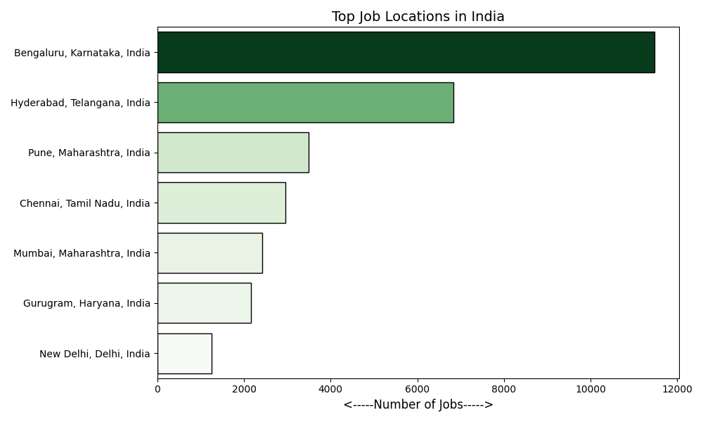
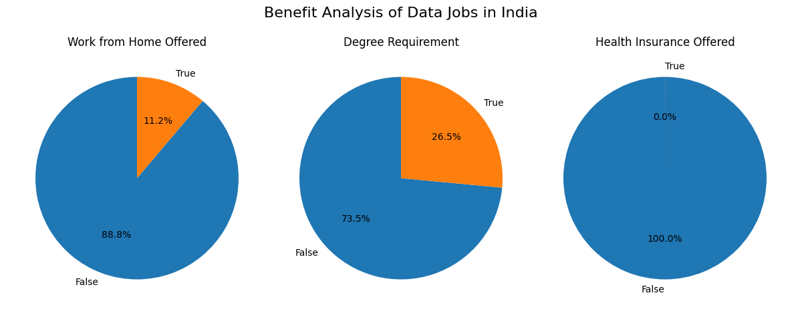
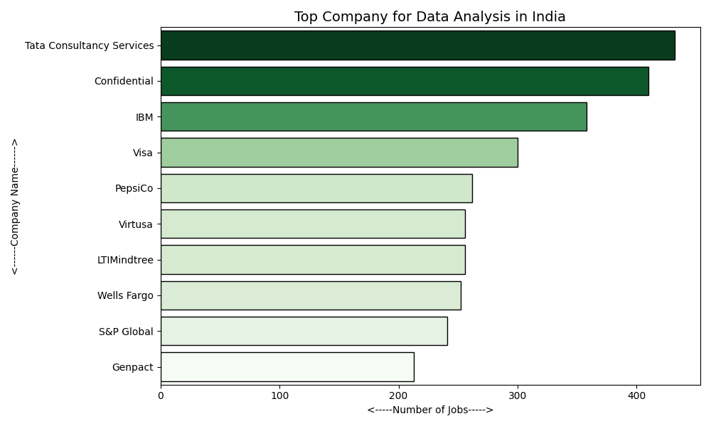
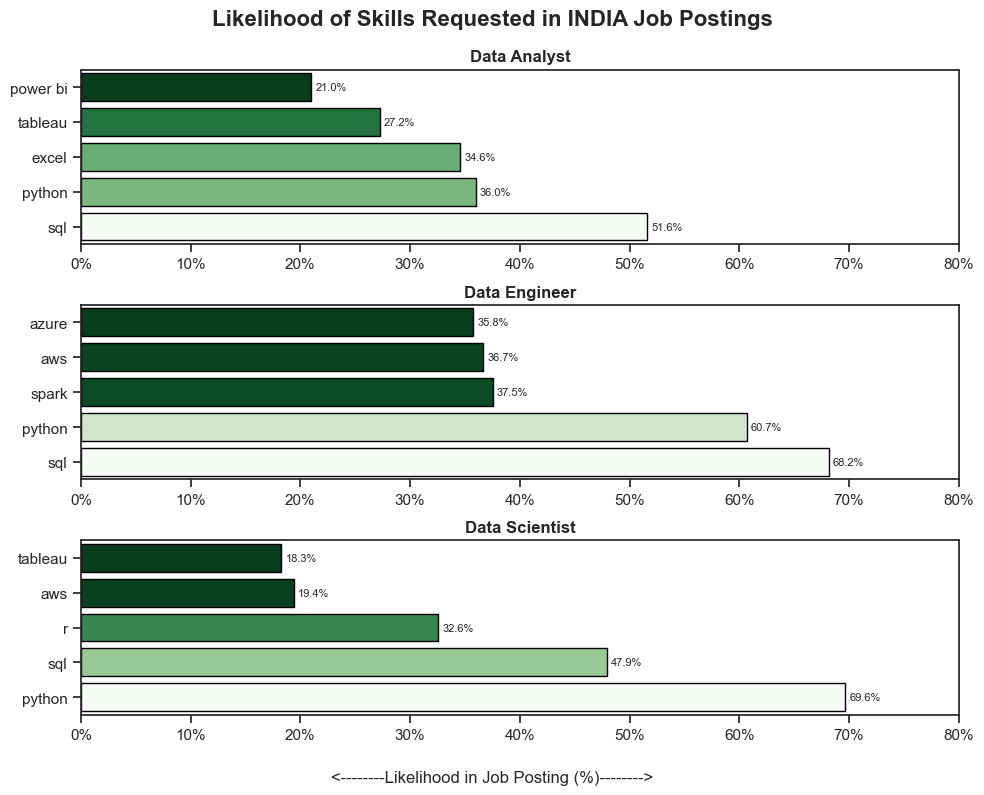
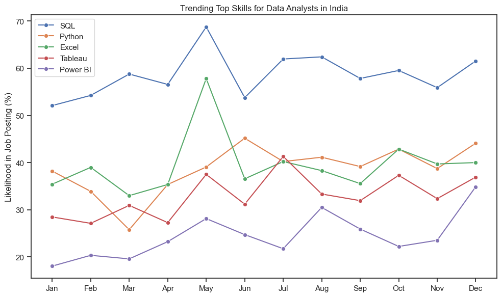
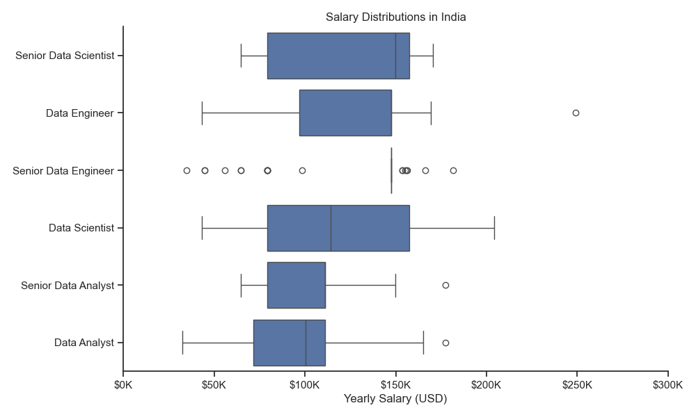
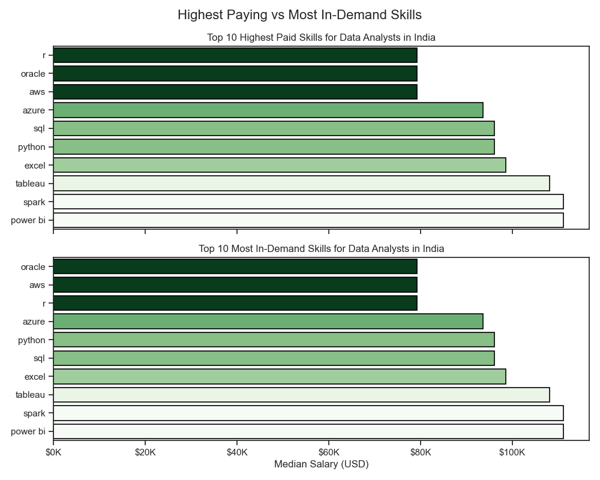
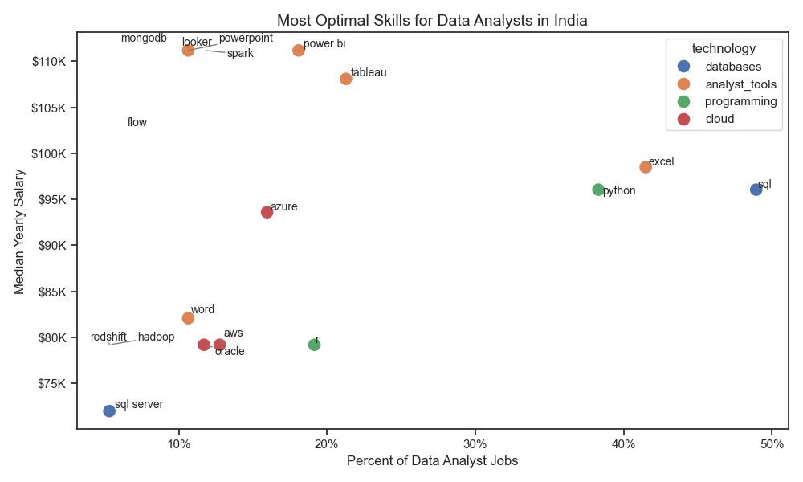

# Exploratory Data Analysis: Data Jobs in India

This project focuses on performing an Exploratory Data Analysis (EDA) on data-related job postings in India. The analysis is divided into six main parts: exploring the introductory statistics (such as top job locations), analyzing the specific skills requested for top data roles (Data Analyst, Data Engineer, and Data Scientist), tracking the trending demand for top skills over the year, analyzing the salary distributions for top data roles, investigating the correlation between median salary and skills for Data Analysts, and identifying the most optimal skills for Data Analysts (high demand and high salary).

## 1. Introduction and Top Job Locations

The first part of our analysis involves loading the dataset, cleaning the data, and identifying the top job locations within India for data professionals.

### Code
```python
# Importing Libraries
import ast
import pandas as pd
from datasets import load_dataset
import matplotlib.pyplot as plt
import seaborn as sns

# Loading Data
dataset = load_dataset('lukebarousse/data_jobs')
df = dataset['train'].to_pandas()

# Data Cleanup
df['job_posted_date'] = pd.to_datetime(df['job_posted_date'])
df['job_skills'] = df['job_skills'].apply(
    lambda x: ast.literal_eval(x) if pd.notna(x) else x
)

# India jobs only
df_IND = df[df['job_country'] == 'India'].copy()

# Remove bad values
df_IND = df_IND[(~df_IND['job_location'].isin(['India', 'Anywhere'])) & (df_IND['job_location'].notna())]

# Top locations
location_counts = (df_IND['job_location'].value_counts().head(7).reset_index())
location_counts.columns = ['job_location', 'count']

# Plotting Top Job Locations in India
plt.figure(figsize=(10, 6))
ax = sns.barplot(
    data=location_counts,
    x='count',
    y='job_location',
    hue='count',
    palette='Greens',
    legend=False,
    edgecolor='black',
    linewidth=1
)

plt.title('Top Job Locations in India', fontsize=14)
plt.xlabel('<-----Number of Jobs----->', fontsize=12)
plt.ylabel('')
plt.tight_layout()
plt.show()
```

### Visualizations





## 2. Likelihood of Skills Requested for Top Roles

In the second part, we dive deeper into the skills mentioned in the job postings. We analyze the percentage likelihood of specific skills being requested for the top three data roles: Data Analyst, Data Engineer, and Data Scientist.

### Code
```python
# Exploding the job_skills list to separate rows
df_skills = df_IND.explode('job_skills')

# Grouping by skills and job title to get counts
df_skills_count = df_skills.groupby(['job_skills', 'job_title_short']).size()
df_skills_count = df_skills_count.reset_index(name='skill_count')
df_skills_count.sort_values(by='skill_count', ascending=False, inplace=True)

# Getting the total number of jobs per title to calculate percentages
df_job_title_count = df_IND['job_title_short'].value_counts().reset_index(name='job_total')
df_skills_perc = pd.merge(df_skills_count, df_job_title_count, how ='left', on = 'job_title_short')

# Calculating skill percent
df_skills_perc['skill_percent'] = 100 * df_skills_perc['skill_count'] / df_skills_perc['job_total']

# Finding the top 3 roles
job_titles = df_skills_count['job_title_short'].unique().tolist()
job_titles = sorted(job_titles[:3])

# Plotting the Likelihood of Skills Requested
from matplotlib.ticker import PercentFormatter

sns.set_theme(style='ticks')

# Create subplots
fig, ax = plt.subplots(len(job_titles), 1, figsize=(10, 8))

for i, job_title in enumerate(job_titles):
    # Filter top 5 skills for each role
    df_plot = (df_skills_perc[df_skills_perc['job_title_short'] == job_title].head(5))

    # Plot
    sns.barplot(
        data=df_plot,
        x='skill_percent',
        y='job_skills',
        ax=ax[i],
        hue='skill_percent',
        palette='Greens_r',
        legend=False,
        edgecolor='black',
        linewidth=1
    )

    # Titles
    ax[i].set_title(job_title, fontsize=12, fontweight='bold')
    
    # Highest value on top
    ax[i].invert_yaxis()
    
    # Consistent scale
    ax[i].set_xlim(0, 80)
    
    # Percentage formatting
    ax[i].xaxis.set_major_formatter(PercentFormatter())
    
    # Remove repeated labels
    ax[i].set_xlabel('')
    ax[i].set_ylabel('')

    # Add value labels
    for container in ax[i].containers:
        ax[i].bar_label(container, fmt='%.1f%%', padding=3, fontsize=8)

# Main title
fig.suptitle('Likelihood of Skills Requested in INDIA Job Postings', fontsize=16, fontweight='bold')

# Shared x-label
fig.supxlabel('<--------Likelihood in Job Posting (%)-------->', fontsize=12)

# Better spacing
fig.tight_layout(h_pad=0.8)

plt.show()
```

### Visualizations


## 3. Trending Skills for Data Analysts in India

The final part of our analysis tracks the trending demand for the top 5 skills (SQL, Python, Excel, Tableau, and Power BI) requested for Data Analyst roles in India over the year.

### Code
```python
# Filter for Data Analysts in India
df_DA_IND = df[(df['job_title'] == 'Data Analyst') & (df['job_country'] == 'India')].copy()
df_DA_IND['job_posted_month_no'] = df_DA_IND['job_posted_date'].dt.month

# Explode skills to get individual counts per month
df_DA_IND_explode = df_DA_IND.explode('job_skills')
df_DA_IND_pivot = df_DA_IND_explode.pivot_table(
    index='job_posted_month_no',
    columns='job_skills',
    aggfunc='size',
    fill_value=0
)

# Calculate monthly totals
df_DA_IND_explode_total = df_DA_IND.groupby('job_posted_month_no').size()

# Convert counts to percentages
df_DA_IND_percent = df_DA_IND_pivot.div(df_DA_IND_explode_total, axis=0) * 100
df_DA_IND_percent = df_DA_IND_percent.reset_index()

# Convert month numbers to short month names
df_DA_IND_percent['job_posted_month'] = (
    df_DA_IND_percent['job_posted_month_no']
    .apply(lambda x: pd.to_datetime(x, format='%m').strftime('%b'))
)
df_DA_IND_percent = df_DA_IND_percent.set_index('job_posted_month')
df_DA_IND_percent = df_DA_IND_percent.drop(columns='job_posted_month_no')

# Plot the top 5 trending skills over time
df_plot = df_DA_IND_percent[['sql', 'python', 'excel', 'tableau', 'power bi']]

plt.figure(figsize=(10, 6))
sns.lineplot(data=df_plot, dashes=False, legend='full', palette='tab10')

plt.title('Trending Top 5 Skills for Data Analysts in India', fontsize=14)
plt.xlabel('Month', fontsize=12)
plt.ylabel('Likelihood in Job Posting (%)', fontsize=12)
plt.legend(title='Skills')
plt.gca().yaxis.set_major_formatter(PercentFormatter())
plt.tight_layout()
plt.show()
```

### Visualizations



## 4. Salary Distributions in India

In this final part, we analyze the salary distributions for the top 6 data-related job titles in India (Data Analyst, Senior Data Analyst, Data Engineer, Senior Data Engineer, Data Scientist, and Senior Data Scientist) using box plots to compare median salaries and ranges.

### Code
```python
# Top 6 job titles
job_titles = [
    'Data Analyst',
    'Senior Data Analyst',
    'Data Engineer',
    'Senior Data Engineer',
    'Data Scientist',
    'Senior Data Scientist'
]

# Filter India jobs
df_IND_top6 = df_IND[df_IND['job_title_short'].isin(job_titles)].copy()

# Remove rows with missing salaries
df_IND_top6 = df_IND_top6.dropna(subset=['salary_year_avg'])

# Order job titles by median salary (highest to lowest)
job_order = (
    df_IND_top6.groupby('job_title_short')['salary_year_avg']
    .median()
    .sort_values(ascending=False)
    .index
)

# Plot style
sns.set_theme(style='ticks')

plt.figure(figsize=(10, 6))

sns.boxplot(
    data=df_IND_top6,
    x='salary_year_avg',
    y='job_title_short',
    order=job_order
)

plt.title('Salary Distributions in India')
plt.xlabel('Yearly Salary (USD)')
plt.ylabel('')

# Format x-axis as $K
ax = plt.gca()

ax.xaxis.set_major_formatter(
    plt.FuncFormatter(
        lambda x, pos: f'${int(x/1000)}K'
    )
)

# Set axis limit to 300K
plt.xlim(0, 300000)

# Show ticks every 50K
plt.xticks(range(0, 300001, 50000))

sns.despine()

plt.tight_layout()

plt.show()
```

### Visualizations



## 5. Salary vs. Skills for Data Analysts in India

In this section, we investigate the relationship between median salary and skills for Data Analyst jobs in India. We analyze both the top 10 highest-paying skills (with a minimum demand filter of 10 postings) and the top 10 most in-demand skills, comparing their median salaries.

### Code
```python
# DATA ANALYST JOBS - INDIA

df_DA_IND = df[
    (df['job_title_short'] == 'Data Analyst') &
    (df['job_country'] == 'India')
].copy()

df_DA_IND = df_DA_IND.dropna(subset=['salary_year_avg'])

# explode skills
df_DA_IND = df_DA_IND.explode('job_skills')

# -------------------------
# TOP PAYING SKILLS
# -------------------------

df_DA_skills = (
    df_DA_IND
    .groupby('job_skills')['salary_year_avg']
    .agg(['count', 'median'])
)

# minimum demand filter
df_DA_skills = df_DA_skills[df_DA_skills['count'] > 10]

df_DA_top_pay = (
    df_DA_skills
    .sort_values('median', ascending=False)
    .head(10)
)

# -------------------------
# MOST DEMANDED SKILLS
# -------------------------

df_DA_top_demand = (
    df_DA_skills
    .sort_values('count', ascending=False)
    .head(10)
)

# sort by salary for cleaner visualization
df_DA_top_demand = (
    df_DA_top_demand
    .sort_values('median', ascending=False)
)

# -------------------------
# PLOT
# -------------------------

sns.set_theme(style='ticks')

fig, ax = plt.subplots(
    2,
    1,
    figsize=(10, 8),
    sharex=True
)

# Top Paying Skills
sns.barplot(
    data=df_DA_top_pay,
    x='median',
    y=df_DA_top_pay.index,
    hue='median',
    palette='Greens_r',
    legend=False,
    edgecolor='black',
    linewidth=1.2,
    ax=ax[0]
)

ax[0].invert_yaxis()
ax[0].set_title(
    'Top 10 Highest Paid Skills for Data Analysts in India'
)
ax[0].set_xlabel('')
ax[0].set_ylabel('')

# Most In-Demand Skills
sns.barplot(
    data=df_DA_top_demand,
    x='median',
    y=df_DA_top_demand.index,
    hue='median',
    palette='Greens_r',
    legend=False,
    edgecolor='black',
    linewidth=1.2,
    ax=ax[1]
)

ax[1].invert_yaxis()
ax[1].set_title(
    'Top 10 Most In-Demand Skills for Data Analysts in India'
)
ax[1].set_ylabel('')
ax[1].set_xlabel('Median Salary (USD)')

# Currency formatting
for axis in ax:
    axis.xaxis.set_major_formatter(
        plt.FuncFormatter(
            lambda x, pos: f'${int(x/1000)}K'
        )
    )

fig.suptitle(
    'Highest Paying vs Most In-Demand Skills',
    fontsize=16
)

fig.tight_layout()
plt.show()
```

### Visualizations



## 6. Most Optimal Skills for Data Analysts in India

In this section, we analyze the optimal skills for Data Analyst jobs in India. We define "optimal skills" as those that have a demand of more than 5% of all job postings and offer high median yearly salaries. We plot these on a scatter plot and color-code them by technology categories (Analyst Tools, Programming, Databases, Cloud) to visualize which skills offer the best payoff.

### Code
```python
# DATA ANALYST JOBS - INDIA
df_DA_IND = df[
    (df['job_title_short'] == 'Data Analyst') &
    (df['job_country'] == 'India')
].copy()

df_DA_IND = df_DA_IND.dropna(subset=['salary_year_avg'])

df_DA_IND_exploded = df_DA_IND.explode('job_skills')

# Group by skill and calculate count + median salary
df_DA_skills = (
    df_DA_IND_exploded
    .groupby('job_skills')['salary_year_avg']
    .agg(['count', 'median'])
    .sort_values(by='count', ascending=False)
)

# Rename columns
df_DA_skills = df_DA_skills.rename(
    columns={
        'count': 'skill_count',
        'median': 'median_salary'
    }
)

# Total Data Analyst jobs
DA_job_count = len(df_DA_IND)

# Skill percentage
df_DA_skills['skill_percent'] = (
    df_DA_skills['skill_count']
    / DA_job_count
    * 100
)

# Filter for skills in more than 5% of jobs
skill_percent = 5
df_DA_skills_high_demand = df_DA_skills[
    df_DA_skills['skill_percent'] > skill_percent
]

# Create technology dictionary
technology_dict = {
    'analyst_tools': [
        'excel',
        'power bi',
        'powerpoint',
        'tableau',
        'word'
    ],

    'programming': [
        'python',
        'r',
        'go'
    ],

    'databases': [
        'sql',
        'sql server'
    ],

    'cloud': [
        'aws',
        'azure',
        'oracle'
    ]
}

df_technology = pd.DataFrame(
    list(technology_dict.items()),
    columns=['technology', 'skills']
)

df_technology = df_technology.explode('skills')

# Merge technology information
df_plot = df_DA_skills_high_demand.reset_index()
df_plot = df_plot.merge(
    df_technology,
    left_on='job_skills',
    right_on='skills',
    how='left'
)

# Plot
sns.set_theme(style='ticks')
plt.figure(figsize=(10, 6))

ax = sns.scatterplot(
    data=df_plot,
    x='skill_percent',
    y='median_salary',
    hue='technology',
    s=150
)

texts = []
for _, row in df_plot.iterrows():
    texts.append(
        plt.text(
            row['skill_percent'],
            row['median_salary'],
            row['job_skills'],
            fontsize=10
        )
    )

adjust_text(
    texts,
    arrowprops=dict(
        arrowstyle='-',
        color='gray'
    )
)

plt.title('Most Optimal Skills for Data Analysts in India', fontsize=14)
plt.xlabel('Percent of Data Analyst Jobs')
plt.ylabel('Median Yearly Salary')

ax.xaxis.set_major_formatter(
    plt.FuncFormatter(lambda x, pos: f'{x:.0f}%')
)

ax.yaxis.set_major_formatter(
    plt.FuncFormatter(lambda x, pos: f'${int(x/1000)}K')
)

plt.legend(title='technology')
plt.tight_layout()
plt.show()
```

### Visualizations



## Conclusion

This exploratory analysis highlights that data-related opportunities in India are heavily concentrated in specific tech hubs. The skill requirements show distinct variations depending on the role, and the demand for top skills like SQL, Python, and Excel shows consistent patterns throughout the year, providing clear pathways for professionals aiming for Data Analyst, Data Engineer, or Data Scientist positions.
